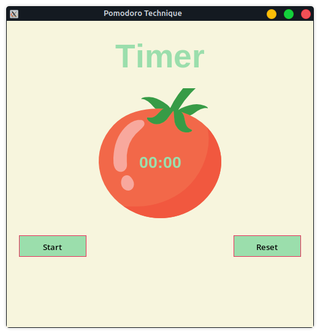

# Pomodoro Technique Timer App



## Overview

This is a minimalistic Pomodoro Technique app created in Python 3 with a graphical user interface (GUI) built using the Tkinter library. The Pomodoro Technique is a time management method that helps you stay focused and productive by breaking your work into intervals, traditionally 25 minutes in length, separated by short breaks.

## Features

- Timer: The app provides a timer that counts down the Pomodoro Technique intervals.
- Start Button: Click the "Start" button to begin a Pomodoro session.
- Reset Button: Click the "Reset" button to reset the timer to its initial state.
- Minimalism: The app follows a simple and minimalist design to reduce distractions during work.
- Productivity Boost: Use the Pomodoro Technique to enhance your productivity and focus.
- Session Tracking: The app keeps track of your completed Pomodoro sessions.

## How to Use

1. Clone or download this repository to your local machine.

   ```bash
   git clone https://github.com//CopAttempted//Pomodoro-Technique.git
   ```

2. Make sure you have Python 3 installed on your system.

3. Open a terminal or command prompt and navigate to the project directory.

4. Run the app using the following command:

   ```bash
   python3 pomodoro_technique.py
   ```

5. The Pomodoro app window will open, and you can start using it for your work sessions.

6. Click the "Start" button to begin a Pomodoro session.

7. The timer will count down for 25 minutes by default, followed by a short break.

8. After completing a session, the app will keep track of your progress.

9. Click the "Reset" button to start a new Pomodoro session.

10. Enjoy increased productivity and better time management!

## Contributions

Feel free to contribute to this project by adding new features or improving the existing code. If you have any suggestions or feedback, please create an issue or submit a pull request.

## License

This Pomodoro Technique app is released under the [MIT License](LICENSE). You are free to use, modify, and distribute it as needed.
